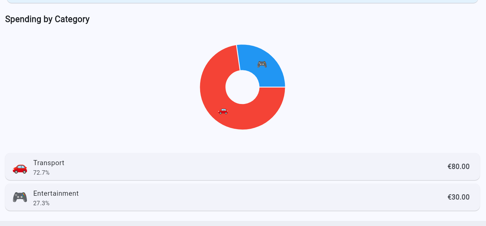
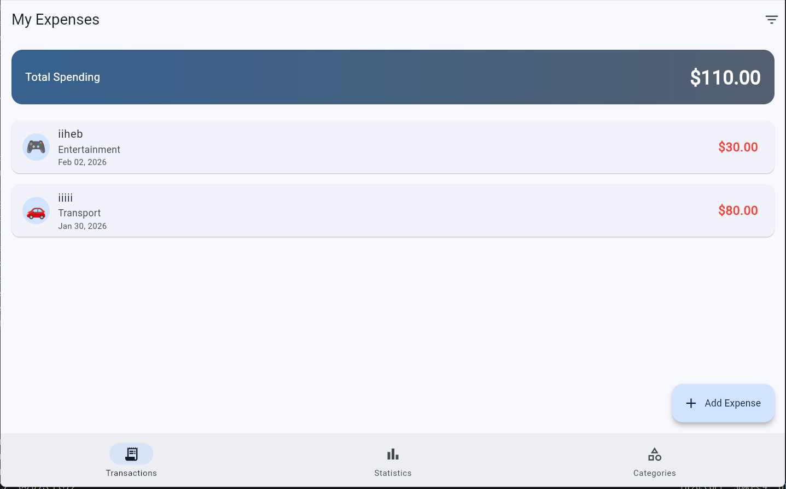

💰 Expense Tracker – AI Smart Assistant

Student: Kraiem Iheb (Matricula: 345053) 

Project Title: Smart Expense Tracker with AI Financial Assistant 

📝 Project Overview
This application is a personal finance manager developed in Flutter. It allows users to track expenses in real-time using Firebase Firestore. The standout feature is an AI Financial Assistant integrated via n8n webhooks, providing personalized spending insights and data analysis directly from the user's transaction history.

📱 User Experience (UX)

Transactions: Users add expenses via a floating button; data syncs instantly with the cloud.

Visual Analytics: A dedicated statistics tab features interactive pie charts for category-wise spending.

AI Chat: A chat interface allows users to ask natural language questions (e.g., "How much did I spend on food?").

Categories: Quick filtering through a responsive grid to view specific transaction details.

🛠 Technology Stack

State Management: provider – chosen for its simplicity and efficiency in managing transaction states across the app.

Database: cloud_firestore – ensures real-time synchronization and multi-device support.

AI Integration: http – connects to a custom n8n workflow that processes queries using LLMs.

Visualization: fl_chart – used for dynamic and interactive data rendering.

💡 Implementation Choices

Hybrid AI Architecture: Instead of on-device ML, I used an n8n webhook to handle complex AI logic, keeping the app lightweight.

Responsive Grid: I implemented an adaptive layout (2 columns on mobile, 4 on web) using MediaQuery to ensure a consistent experience across platforms.

Real-time Listeners: Used Firestore streams to ensure the UI updates automatically whenever a transaction is added or deleted.